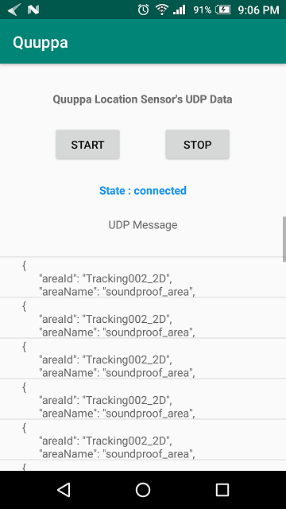

# Quuppa

[Quuppa](https://quuppa.com/) is a Real Time Locating System (RTLS). Bluetooth Low Energy (BLE) devices can be connected with Quuppa server and track their position and data. Here, BLE devices like location sensor device and pressure sensor devices have been used. Thsese devices are connected with Quuppa server. The server continuously send UDP packets to a particular ip address and port in the form of JSON file which contain location and pressure sensor data. An Android application has been developed to get this real time data from server and save in mobile storage. The application works as a client.

After collecting the JSON files different types of features (mean, std, max, speed etc.) are calculated. These features are used in human activity recognition.

# Files

  - **UDPServer.java :** Server side code to send **UDP** packets to a particular port
  - **Client :** Android application that recevies **UDP** packets and saves as JSON file in mobile storage
   
  
# IDE

- **Android Studio**
